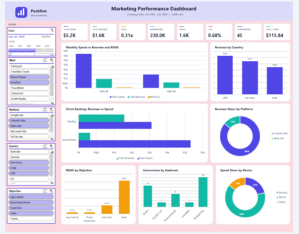

## Dashboard Preview

# Marketing Campaign Performance Dashboard

## Overview

This project is an **Excel-based Marketing Campaign Performance Dashboard** created to turn raw digital marketing campaign data into a clear and easy-to-use management report.

The main goal was to answer a simple business question:

> **Which marketing campaigns, platforms, clients, and segments are performing well, and where is the marketing budget being used inefficiently?**

Instead of looking through thousands of individual campaign records, the dashboard brings the most important information into one place so that a manager can quickly understand overall performance and investigate specific areas.

---

## Business Problem

Marketing teams generate a large amount of campaign data every day.

Looking at raw data makes it difficult to quickly answer questions such as:

* How much money was spent on campaigns?
* How much revenue was generated?
* Which campaigns are giving the best return?
* Which platforms are performing better?
* Which clients or countries are generating better results?
* Which campaigns have high spending but poor results?
* How are clicks and conversions changing?
* Which campaigns should be investigated or optimized?

The business needed a simple reporting solution that could convert raw campaign data into **useful management-level information**.

---

## My Approach

I built the dashboard in **Microsoft Excel** using a structured campaign dataset containing **5,000+ records**.

The project followed a simple data-analysis workflow:

**Raw Data → Data Preparation → Calculations → Analysis → Dashboard → Business Insights**

### 1. Data Preparation

I worked with campaign-level data containing fields such as:

* Date
* Campaign ID
* Campaign Name
* Client
* Platform
* Objective
* Ad Type
* Country
* Device
* Audience
* Impressions
* Clicks
* Spend
* Conversions
* Revenue

I organized the data into a structured format so it could be used for calculations, PivotTables, and dashboard reporting.

---

### 2. KPI Calculations

I created and analyzed important marketing performance metrics including:

| KPI                 | Purpose                                       |
| ------------------- | --------------------------------------------- |
| **Spend**           | Total advertising cost                        |
| **Revenue**         | Revenue generated from campaigns              |
| **ROAS**            | Return generated for advertising spend        |
| **Impressions**     | Number of times ads were shown                |
| **Clicks**          | Number of user clicks                         |
| **CTR**             | Percentage of impressions resulting in clicks |
| **Conversions**     | Number of completed desired actions           |
| **CPC**             | Average cost per click                        |
| **CPA**             | Cost required to generate a conversion        |
| **Conversion Rate** | Percentage of clicks resulting in conversions |

These KPIs help connect marketing activity with business performance.

---

## Dashboard

The dashboard was designed as a management-level summary rather than just a collection of charts.

It provides a quick view of campaign performance and allows the user to explore the data from different perspectives.

### Main Dashboard Areas

* Overall marketing KPIs
* Campaign performance
* Platform performance
* Client performance
* Country performance
* Campaign objective analysis
* Audience and device analysis
* Performance trends
* Spend and revenue analysis
* ROAS and efficiency analysis

---

## Interactive Analysis

I used Excel's reporting and analysis features to make the dashboard easier to explore.

The dashboard allows performance to be analyzed using different dimensions such as:

* Client
* Platform
* Country
* Campaign Objective
* Audience
* Device
* Date / time period

This makes it possible to move from a high-level business view to a more detailed campaign-level analysis.

---

## Excel Techniques Used

### Data Analysis

* Excel Tables
* Data Cleaning
* Calculated Metrics
* KPI Analysis
* Sorting and Filtering
* Conditional Analysis

### Reporting

* PivotTables
* Pivot-based analysis
* KPI cards
* Charts and visualizations
* Interactive filters

### Marketing Analytics

* ROAS analysis
* CTR analysis
* CPC analysis
* CPA analysis
* Conversion analysis
* Spend vs Revenue analysis
* Campaign comparison

---

## What I Learned

This project helped me understand how an MIS/Data Analyst can move beyond simply preparing reports.

I learned how to:

* Convert raw business data into a structured reporting dataset.
* Select KPIs that are relevant to a business problem.
* Build reports that are easy for non-technical users to understand.
* Compare performance across multiple business dimensions.
* Identify inefficient and high-performing areas.
* Present data in a management-friendly format.
* Use Excel as an end-to-end reporting and analysis tool.

---

## Business Value

The main value of this dashboard is **faster decision-making**.

Instead of manually reviewing thousands of campaign records, a manager can use the dashboard to quickly identify:

* Where advertising money is being spent
* Which campaigns generate stronger returns
* Which platforms perform better
* Where conversion performance is weak
* Which areas require further investigation
* How campaign performance changes across different segments

The dashboard therefore acts as a **single reporting view for marketing performance**.

---

## Project Outcome

The final result is a reusable Excel reporting solution that transforms raw campaign-level data into a **management-ready marketing performance dashboard**.

The project demonstrates my ability to work across the complete reporting process:

**Raw Data → Analysis → KPI Development → Dashboard → Business Insights**

